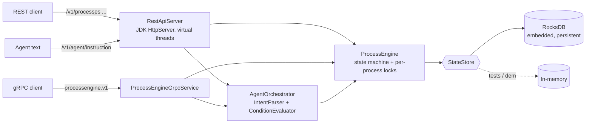

# Transactional Process Engine API with RocksDB State Storage

[](https://github.com/vednk-shinde/Transactional-Process-Engine-API-with-RocksDB-State-Storage/actions/workflows/ci.yml)


A process orchestration engine. You create, pause, resume, mutate and complete long-running transactional processes through a **versioned REST and gRPC API**, state is kept in an **embedded RocksDB** store, and an **agent** turns free-text instructions such as `resume process ORD-1 if inventory > 0` into real, conditional state changes.

```bash
docker compose up --build        # REST on :8080, gRPC on :9090, state in a RocksDB volume
```

```bash
curl -X POST localhost:8080/v1/processes -d '{"processId":"ORD-1001","processType":"order-fulfillment"}'
curl -X POST localhost:8080/v1/processes/ORD-1001/mutate -d '{"inventory":"0"}'
curl -X POST localhost:8080/v1/processes/ORD-1001/pause
curl -X POST localhost:8080/v1/agent/instruction -d '{"instruction":"resume process ORD-1001 if inventory > 0"}'
# {"result":"Resume refused for ORD-1001: condition 'inventory > 0' not met (current value: 0)."}
curl -X POST localhost:8080/v1/agent/instruction -d '{"instruction":"set inventory=5 on process ORD-1001"}'
curl -X POST localhost:8080/v1/agent/instruction -d '{"instruction":"resume process ORD-1001 if inventory > 0"}'
# {"result":"Resumed ORD-1001 (condition 'inventory > 0' met)."}
```

## Architecture



```
CREATED -> RUNNING <-> PAUSED -> COMPLETED
                \-----------> FAILED          (COMPLETED and FAILED are terminal and frozen)
```

## API

| Method | Path | Result |
|---|---|---|
| `POST` | `/v1/processes` `{processId, processType}` | `201` created and RUNNING; `409` id exists; `400` missing fields |
| `GET` | `/v1/processes/{id}` | `200`; `404` |
| `POST` | `/v1/processes/{id}/pause` | `200`; `400` if not RUNNING |
| `POST` | `/v1/processes/{id}/resume` | `200`; `400` if not PAUSED |
| `POST` | `/v1/processes/{id}/mutate` `{"k":"v",...}` | `200` updated variables; `400` if terminal |
| `POST` | `/v1/processes/{id}/complete` | `200`; `400` if already terminal |
| `POST` | `/v1/agent/instruction` `{instruction}` | `200` result text; `400` unparseable; `404` unknown process |
| `GET` | `/healthz` | `200` |

gRPC (`proto/process_engine_v1.proto`, package `processengine.v1`): `CreateProcess`, `GetProcess`, `PauseProcess`, `ResumeProcess` (optional `condition_expr`), `MutateProcess`, `ExecuteAgentInstruction`. Errors use canonical status codes: `NOT_FOUND`, `ALREADY_EXISTS`, `FAILED_PRECONDITION` (illegal transition or unmet condition), `INVALID_ARGUMENT`.

### Agent instruction grammar

| Instruction | Effect |
|---|---|
| `pause process <id>` | Pause a RUNNING process |
| `resume process <id> [if <var> <op> <value>]` | Resume, but only if the condition holds against the live variables (`> < >= <= == !=`) |
| `set k=v, k2=v2 on process <id>` | Mutate variables |
| `query process <id>` / `status of process <id>` | Describe the process |

The parser is a deliberate keyword/regex layer, not an LLM call: it produces typed `AgentCommand` values, so swapping in an LLM-based parser later changes nothing downstream.

## Why these choices

| Choice | Reason |
|---|---|
| **Embedded RocksDB** | Process state is read and written on every transition. An in-process LSM store avoids a network hop (sub-millisecond local access), keeps keys sorted so `process:` prefix scans are cheap, and needs no separate database to run. |
| **64MB write buffer, no per-write fsync** | Fewer, larger flushes under write pressure. Writes still go to the WAL, so a process crash loses nothing; only a power loss can drop the last few milliseconds. A deliberate durability/throughput trade-off. |
| **Per-process locks** | Pause, resume and mutate on the same process are serialized, so two concurrent creates can never both win and a pause can never interleave with a resume. Different processes never contend. Tested with 32 racing creators and 50 concurrent writers. |
| **`StateStore` interface** | The engine does not know which store it has. The same contract test runs against the in-memory and RocksDB implementations. |
| **Versioned `/v1/` and `processengine.v1`** | A breaking change ships as `v2`, never by editing `v1`. Responses only gain optional fields. The proto reserves removed field numbers and names (`reserved 5; reserved "legacy_status_code";`) and keeps enum value 0 as `_UNSPECIFIED`. |
| **JDK `HttpServer` on virtual threads** | Zero framework dependencies for the REST layer, with cheap concurrency. |
| **Multi-stage Docker, non-root, volume for `/data`** | Small runtime image, no build tools shipped, and state survives container restarts (CI checks this). |

## Tests

```bash
mvn verify      # 44 tests, JaCoCo report in target/site/jacoco/index.html (about 97% instruction coverage)
```

Covers the state machine and illegal transitions, concurrency races, serialization round-trips with awkward characters, restart recovery over the same store, the agent parser and condition evaluator, both `StateStore` implementations (including real RocksDB reopen and concurrent writers), the REST API over real HTTP, and the gRPC service over an in-process channel. Generated protobuf code and `Main` are excluded from coverage.

CI builds and tests on every push, then builds the image, starts it with Compose, exercises the API, restarts the container and checks the paused process is still there.

## Project layout

```
.
├── .github/workflows/ci.yml
├── Dockerfile  docker-compose.yml  pom.xml
├── proto/process_engine_v1.proto           versioned gRPC contract
└── src
    ├── main/java/com/example/processengine
    │   ├── core/        ProcessEngine, ProcessInstance, ProcessState, exceptions
    │   ├── agent/       IntentParser, ConditionEvaluator, AgentOrchestrator, AgentCommand
    │   ├── api/         RestApiServer
    │   ├── grpc/        ProcessEngineGrpcService
    │   ├── storage/     StateStore, InMemoryStateStore, RocksDbStateStore
    │   └── Main.java    server (env-configured) or --demo
    └── test/java/...    unit, integration and contract tests
```

Configuration (environment): `STORE` (`rocksdb` default, or `memory`), `DB_PATH` (default `./data`), `HTTP_PORT` (8080), `GRPC_PORT` (9090). Run the scripted walk-through without Docker: `java -jar target/process-engine-api-1.0.0.jar --demo`.

## Limitations

- The REST layer uses a minimal flat-JSON parser (string values only, no escaped quotes inside values). Production use would swap in a JSON library.
- No authentication or TLS on either API; this is a backend component meant to sit behind a gateway.
- Single node: locks are in-process and RocksDB is embedded, so there is no replication or horizontal scaling.
- The condition grammar is intentionally tiny (`var op value`), not a general expression language.

## License

MIT
